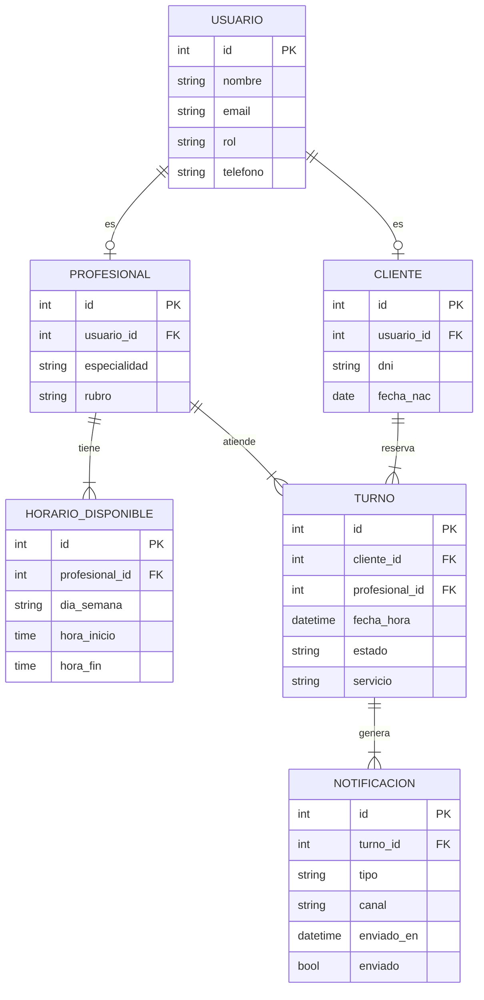

# Modelo Entidad-Relación — Sistema de Gestión de Turnos

**Materia:** Desarrollo de Software  
**Grupo:** 1  
**Responsable:** Gianluca Ragonese  

---

## Diagrama

---

## Descripción de tablas

### USUARIO
Base de todos los actores del sistema. El campo `rol` puede tomar los valores: `cliente`, `profesional`, `recepcionista` o `admin`.

### CLIENTE
Extiende a USUARIO con datos específicos del cliente. Relación 1 a 1 con USUARIO.

### PROFESIONAL
Extiende a USUARIO con datos específicos del profesional (especialidad y rubro). Relación 1 a 1 con USUARIO.

### HORARIO_DISPONIBLE
Almacena los bloques horarios en los que cada profesional está disponible. Un profesional puede tener múltiples horarios (N por profesional).

### TURNO
Entidad central del sistema. Une a un cliente con un profesional en una fecha y hora determinada. El campo `estado` puede ser: `pendiente`, `confirmado`, `cancelado` o `completado`.

### NOTIFICACION
Registra cada mensaje enviado relacionado a un turno. Un turno puede generar múltiples notificaciones (confirmación, recordatorio, cancelación, etc.).

---

## Relaciones

| Relación | Tipo | Descripción |
|---|---|---|
| USUARIO → CLIENTE | 1 a 1 | Un usuario puede ser cliente |
| USUARIO → PROFESIONAL | 1 a 1 | Un usuario puede ser profesional |
| PROFESIONAL → HORARIO_DISPONIBLE | 1 a N | Un profesional tiene muchos horarios |
| CLIENTE → TURNO | 1 a N | Un cliente puede reservar muchos turnos |
| PROFESIONAL → TURNO | 1 a N | Un profesional puede atender muchos turnos |
| TURNO → NOTIFICACION | 1 a N | Un turno genera muchas notificaciones |
